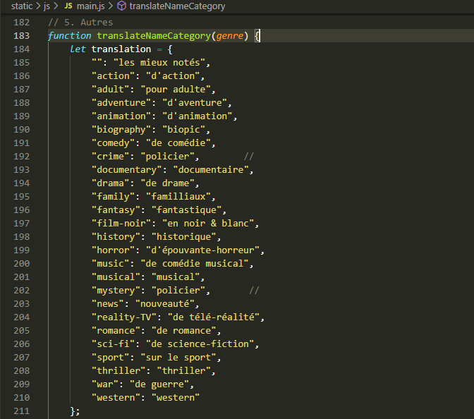

 
# L'application web JustStreamIt #

1.  [Description](#description)
2.  [Installation](#installation)
3.  [Utilisation](#utilisation)
    1.  [Front-end](#front-end)
    2.  [Back-end](#back-end)
4.  [À propos](#a-propos)
    1.  [Bugs connus](#bugs-connus)
    2.  [Améliorations futures](#améliorations-futures)

 
## 1. Description  ##

    Ce script à été réalisé dans le cadre d'un projet du parcours
    'Développeur d'application - Python' d'OpenClassROoms.

\
Permet à ses utilisateurs de visualiser en direct les 7 meilleurs films, pour quelques genres cinématographiques.

Les classements sont basés sur les critères décroissants suivants : score IMDB, puis nombre de votants

\
Cette application fonctionne grâce à l'API local d'OpenClassrooms liée à ce projet. Elle n'est pas présente dans ce dépôt (vous la trouverez à cette adresse : [API d'OC](https://github.com/OpenClassrooms-Student-Center/OCMovies-API-EN-FR)).

 
## 2. Installation  ##

1. Cloner ce dépôt à l'aide de la commande `$ git clone https://github.com/geoffrey-ll/P06_GL_JustStreamIt` ou téléchargez-le [ici](https://github.com/geoffrey-ll/P06_GL_JustStreamIt/archive/refs/heads/master.zip).
2. Si vous ne l'avez pas, récupérez l'API d'OpenClassrooms [API d'OC](https://github.com/OpenClassrooms-Student-Center/OCMovies-API-EN-FR) et suivez les instructions du README pour la première exécution.
3. Depuis un terminal, déplacez-vous à la racine de l'API.
4. Démarrez le serveur avec `$ python manage.py runserver` ([commande avec pipenv](https://github.com/OpenClassrooms-Student-Center/OCMovies-API-EN-FR#installation-et-ex%C3%A9cution-de-lapplication-avec-pipenv))
5. Ouvrez le fichier index.html dans le navigateur de votre choix 
    \
    (fonctionnement vérifié pour : Mozilla Firefox 94.0.2 ; Google Chrome dev 98.0.4758.9 ; Microsoft Edge 96.0.1054.57). 

\
Les étapes 1 et 2 ne sont nécessaires que pour la première utilisation.

 
## 3. Utilisation  ##

###### FRONT-END  ######
- Des flèches de navigations permettent de se déplacer parmis les 7 films d'une catégorie.
- Un clique sur l'affichage d'un film permet l'ouverture de la fenêtre modal affichant les informations sur le film.
- Trois façons de fermer la fenêtre modal :
    - Le bouton de fermeture.
    - Cliquer en dehors de la fenêtre modal.
    - La touche Echap.

###### BACK-END  ######

- Modifier les genres cinématographiques affichés :
    \
    Ouvrir le fichier static/js/main.js dans un éditeur de texte.
    \
    
    \
        - Pour que soit affichés le classement pour tout les genres cinématographiques : 
        \
        ligne 5 : remplacez `$ "no"` par `$ "yes"`
        - Pour afficher le classement que pour certains genres cinématographiques :
        \
        ligne 11 : entrez le nom des genres entre guillements et séparez les d'une virgule. Sur l'image ci-dessus, ce sont les catégories biographie, science-fiction et aventure qui seront affichés.
        \
        `$ ""` correspond au classement tous genres confondus.

- Vous trouverez la liste exhaustive des genres disponibles au sein de la fonction translateNameCategory du fichier static\js\main.js :
    \
    

 
## 4. À propos  ###
 
### i. Bugs connus  ###

- Certains genres de films contiennent moins de 7 films. Le déplacement du carrousel et l'opacité des flèches pour y naviguer, sont basés sur ce chiffre.
Ainsi, pour les catégories concernées, le carrousel pourra être entièrement vidé de poster, car peuvent tout de même se décaller de 7 positions.
- Écrire deux fois le même genre de film, dans la liste des genres (static.js.main.js ligne 11) : la 1er itération s'affichera correctement, la 2ème sera vide (seul les flèches de navigations seront visibles)

 
### ii. Amélioration futures  ###

- Mettre une animation lors du déplacement du carrousel.
- Rendre le nombre de films par classement (actuellement 7) facilement modifiable en back-end (à l'instar du choix des catégories).
- Input (liste déroulante) pour laisser l'utilisateur choisir les catégories à afficher ??
